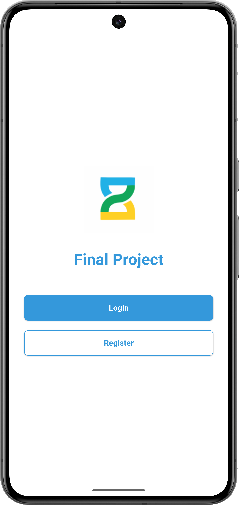
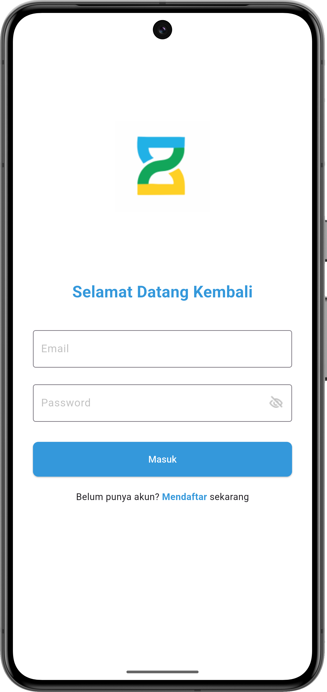
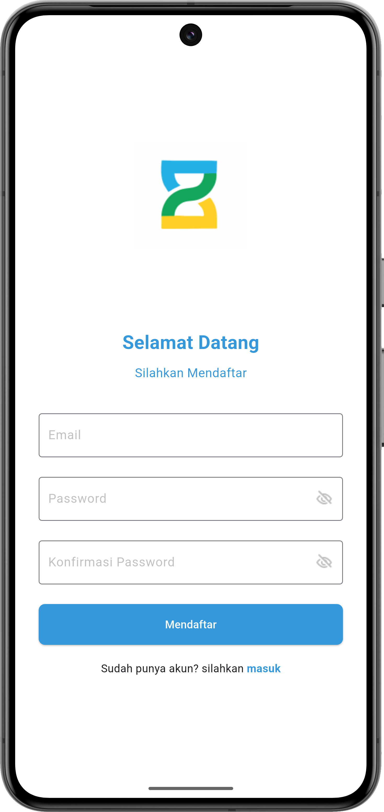
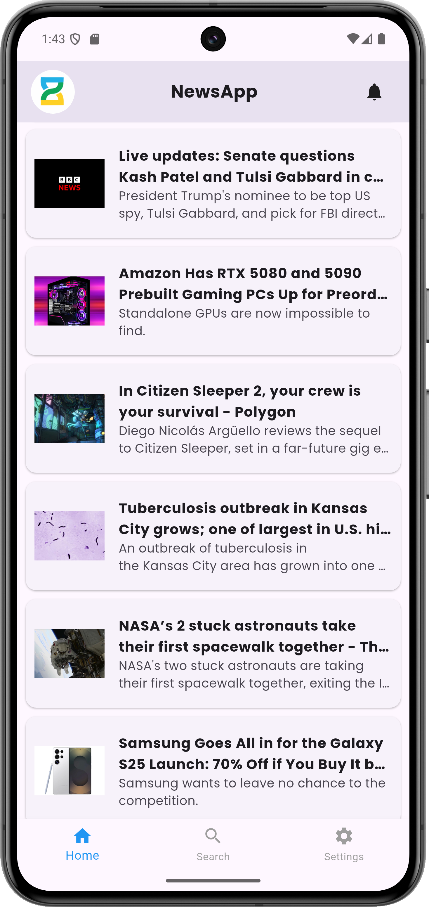
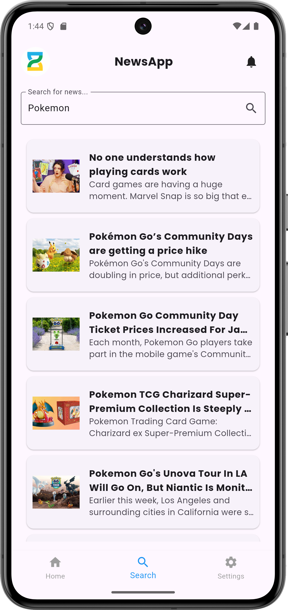
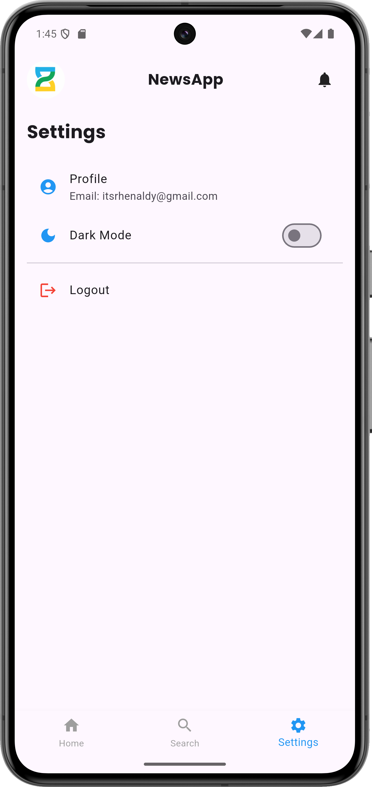
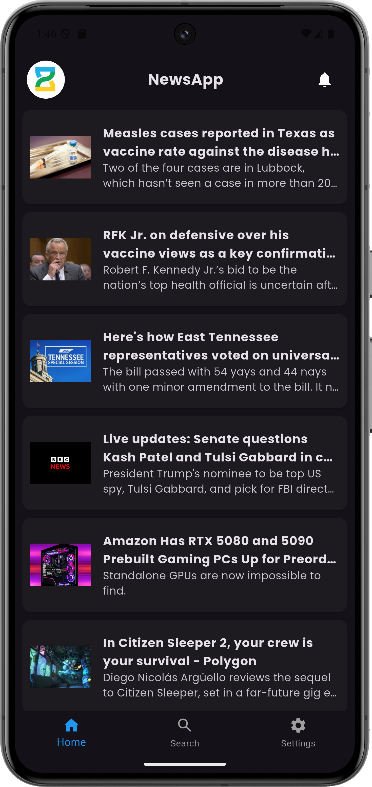
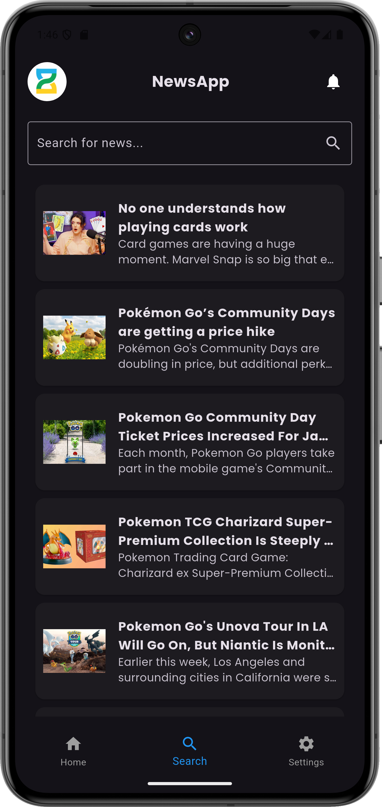
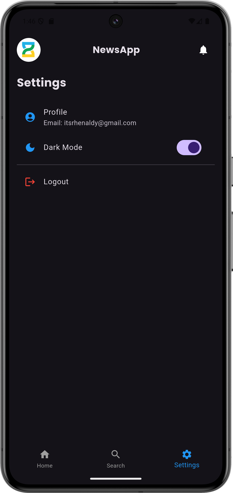

# Final Project Flutter

A Flutter project by Rhenaldy Chandra

## Getting Started

This project is a starting point for a Flutter application.

### Judul Aplikasi

**NewsApp - Aplikasi Pengumpul Berita**

### **Deskripsi Umum**
Aplikasi NewsApp adalah aplikasi berbasis Flutter yang memungkinkan pengguna untuk melihat berita terkini, mencari berita, dan membaca artikel lengkap. Aplikasi ini menggunakan Firebase untuk autentikasi pengguna (login dan registrasi), GetX untuk manajemen state, serta melakukan permintaan HTTP untuk mengambil berita dari NewsAPI.

### **Fitur Aplikasi**:
- **Autentikasi Pengguna**: Pengguna dapat mendaftar dan masuk menggunakan email dan kata sandi melalui Firebase Authentication.
- **Daftar Berita**: Aplikasi menampilkan berita terkini yang diambil dari NewsAPI.
- **Pencarian Berita**: Pengguna dapat mencari artikel berita berdasarkan kata kunci tertentu.
- **Detail Berita**: Pengguna dapat mengklik berita untuk melihat detail artikel yang mencakup gambar, judul, deskripsi, dan tautan sumber.
- **Pengaturan**: Pengguna dapat mengubah mode gelap, melihat informasi profil, dan keluar dari aplikasi.
- **UI Responsif**: Aplikasi dirancang dengan antarmuka pengguna yang intuitif dan responsif menggunakan widget Flutter.

### **Dependensi yang Digunakan**:
- **Firebase Authentication**: Untuk menangani proses login dan registrasi pengguna.
- **GetX**: Untuk manajemen state dan navigasi antar halaman.
- **http**: Untuk melakukan permintaan HTTP ke NewsAPI guna mengambil data berita.

### **API yang Digunakan**:
- **NewsAPI**:  
  Aplikasi ini menggunakan NewsAPI untuk mengambil berita terkini dan mencari artikel berita.
  
  - **Base URL**: `https://newsapi.org/v2/top-headlines?country=us&apiKey=<YOUR_API_KEY>`
  - **API Key**: `'18606cb135ac400f8ad2514e41fc327a'`
  
  Fungsi-fungsi yang disediakan oleh NewsAPI:
  
  1. **Mengambil Berita Terkini**:
     - Endpoint: `$_baseUrl&page=$page&pageSize=$limit`
     - Digunakan untuk mengambil berita terkini dengan dukungan pagination (parameter `page` dan `limit`).
  
  2. **Mencari Berita**:
     - Endpoint: `https://newsapi.org/v2/everything?q=$keyword&apiKey=$_apiKey`
     - Digunakan untuk mencari artikel berita berdasarkan kata kunci yang diberikan pengguna.
     
---

## Penjelasan Kode Aplikasi

### 1. **Controller (news_controller.dart)**:
   - **NewsController**: Mengelola state dari daftar berita, pagination, dan pencarian. Controller ini berinteraksi dengan `NewsService` untuk mengambil dan mencari berita.
     - `fetchNews()`: Mengambil berita terkini dari NewsAPI dengan dukungan pagination.
     - `searchNews()`: Mencari berita berdasarkan kata kunci yang diberikan pengguna.

### 2. **Model (news_model.dart)**:
   - **News**: Merupakan representasi dari artikel berita dengan properti seperti `title`, `description`, `url`, dan `imageUrl`.
     - `fromJson()`: Konstruktor factory yang mengonversi respons JSON dari NewsAPI menjadi objek `News`.

### 3. **Halaman (UI Pages)**:
   - **GetStartedPage**: Menampilkan halaman awal dengan tombol untuk login dan registrasi.
   - **LoginPage**: Halaman untuk login menggunakan Firebase Authentication.
   - **RegisterPage**: Halaman untuk registrasi pengguna baru menggunakan Firebase Authentication.
   - **MainPage**: Halaman utama dengan bottom navigation bar, memungkinkan pengguna untuk menavigasi antara halaman Berita (home), Pencarian, dan Pengaturan.
   - **NewsDetailPage**: Menampilkan tampilan detail artikel berita, termasuk gambar, judul, deskripsi, dan tautan ke artikel lengkap.

### 4. **Layanan (news_service.dart)**:
   - **NewsService**: Mengelola semua interaksi API terkait berita. Menggunakan paket HTTP untuk mengirim permintaan GET ke NewsAPI.
     - `fetchNews()`: Mengambil berita terkini.
     - `searchNews()`: Mencari artikel berita berdasarkan kata kunci.

### 5. **Autentikasi (Firebase Authentication)**:
   - **Login & Registrasi**: Pengguna melakukan autentikasi menggunakan Firebase Authentication, yang memungkinkan mereka untuk login dan registrasi menggunakan email dan kata sandi.

---

### Endpoint API:

- **Mengambil Berita**: 
  - **URL**: `https://newsapi.org/v2/top-headlines?country=us&apiKey=YOUR_API_KEY`
  - **Parameter**: 
    - `page` (int): Nomor halaman untuk pagination (default 1).
    - `pageSize` (int): Jumlah berita per halaman (default 10).

- **Mencari Berita**: 
  - **URL**: `https://newsapi.org/v2/everything?q=YOUR_KEYWORD&apiKey=YOUR_API_KEY`
  - **Parameter**: 
    - `q` (string): Kata kunci pencarian.

### Kesimpulan
Aplikasi ini memberikan pengalaman pengguna yang mudah untuk menjelajahi dan mencari berita. Aplikasi ini didukung oleh NewsAPI dan menggunakan Firebase untuk autentikasi pengguna. Aplikasi ini menunjukkan bagaimana mengintegrasikan Flutter dengan manajemen state (GetX) dan API RESTful.

---

## Screenshots

### Get Started and Login Pages

  
  

### Register and News Pages

  
  

### Search and Settings Pages

  
  

## Dark Mode

### News Page 

### Search Page

### Settings Page 

